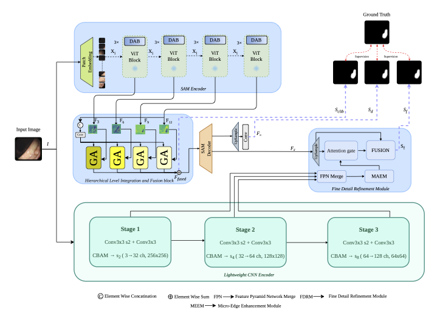

# BAHNet: Boundary-Aware Hybrid Network for Accurate Polyp Segmentation in Colonoscopy Images

[](https://github.com/susanta75/BAHNet)
[](LICENSE)

## Abstract

Missed colorectal polyps during colonoscopy screening remain a leading source of
interval cancers; automated, boundary-precise segmentation can reduce this clinical
risk by supporting consistent, operator-independent lesion delineation at scale.
However, the Segment Anything Model (SAM) — the strongest available foundation model
for segmentation — irrecoverably discards sub-patch spatial detail through its
fixed-size patch tokenization, systematically under-segmenting small and flat polyps
before any domain-specific processing begins. **BAHNet** tackles this structural
limitation by pairing SAM's global semantic pathway with a lightweight parallel CNN
branch that operates at full pixel resolution, recovering exactly the boundary detail
the tokenization step discards. Domain-specific adaptation aligns the encoder features
to colonoscopy statistics, multi-scale aggregation consolidates encoder
representations, and a semantically guided refinement step merges the two pathways
into a sharp final mask. On four public benchmarks, BAHNet outperforms current
state-of-the-art methods on **both seen and unseen datasets**, with gains of 1.4
points in mean Dice and 1.1 points in mean IoU on ETIS-LaribPolypDB (unseen) over the
strongest baseline — while adding only **1.6% parameter overhead** on top of the
frozen SAM ViT-B backbone.

## Key Components

- **Dual-pathway framework** — SAM ViT-B (global semantics) running in parallel with a
  lightweight CNN branch that independently preserves sub-patch boundary detail.
- **Domain Adaptation Block (DAB)**, with an embedded **Multi-Scale Spatial Enhancement
  Block (MSEB)** — adapts SAM's generic ViT features to the colonoscopy domain without
  retraining the backbone.
- **Hierarchical Level Integration and Fusion block (HLIF)** — a consensus-driven
  dual-gating mechanism that fuses four hierarchical encoder features into one
  representation.
- **Sub-Patch Preservation Encoder (SPPE)** — a CNN branch operating at full pixel
  resolution, extracting multi-scale boundary features independently of the ViT
  pathway.
- **Boundary-Aware Refinement Module (BARM)** — a four-stage fusion pipeline (FPN
  Merge → MAEM → Semantic Attention Gate → Cascaded Fusion Head) that merges SAM and
  SPPE features into the final mask.
- **Composite Loss with Spatial Consistency Regularization (SCR)** — pixel-level and
  structural losses plus soft spatial priors that stabilize training on small-polyp
  subsets.

## Results

Evaluated on two **seen** datasets (used in training) and two **unseen** datasets
(held out entirely, for cross-dataset generalization):

| Dataset | Split | mDice↑ | mIoU↑ | F<sub>M</sub>↑ | S<sub>M</sub>↑ | E<sub>M</sub>↑ | MAE↓ |
|---|---|---|---|---|---|---|---|
| CVC-ClinicDB | Seen | **0.953** | **0.907** | **0.962** | **0.959** | **0.989** | **0.006** |
| Kvasir-SEG | Seen | **0.942** | **0.895** | **0.963** | **0.938** | **0.981** | **0.014** |
| CVC-ColonDB | Unseen | **0.821** | **0.742** | **0.869** | **0.882** | **0.919** | 0.021 |
| ETIS-LaribPolypDB | Unseen | **0.804** | **0.731** | **0.858** | **0.889** | **0.934** | **0.012** |

BAHNet ranks first or second on every metric across all four benchmarks against 23
compared SOTA methods spanning CNN, transformer, SAM-based, and hybrid architectures,
and the ranking on seen data is *preserved* (not reversed) on unseen data — evidence
of genuine generalization rather than dataset-specific memorization. Gains are most
pronounced on small polyps (≤1000 px), the lesion category most associated with
interval cancer when missed.

**Efficiency.** The three newly proposed lightweight modules (HLIF + SPPE + BARM)
add just 1.32M parameters on top of the frozen 96.25M-parameter SAM ViT-B encoder —
101.2M total, with only 1.49M (1.6%) of overhead over the plain SAM baseline.

## Architecture


<!-- NOTE: export figures/model_architecture.pdf to a PNG/JPG at this path —
     GitHub's  syntax can't render an embedded PDF. -->

## Code

> **The full source code, pretrained weights, and training/evaluation scripts will be
> released upon acceptance of the paper.**
>
> If you have any questions in the meantime, please open an issue or contact us at
> skhamrui2002@gmail.com

## Citation

If you find this work useful, please consider citing:

```bibtex
@article{bahnet2026,
  title   = {BAHNet: Boundary-Aware Hybrid Network for Accurate Polyp Segmentation
             in Colonoscopy Images},
  author  = {Khamrui, Susanta and Penhaker, Marek and Krejcar, Ondrej and Seal, Ayan},
  journal = {IEEE Journal of Biomedical and Health Informatics},
  year    = {2026},
  note    = {Under Review}
}
```

## Datasets

The following public datasets are used in this work:

- [Kvasir-SEG](https://datasets.simula.no/kvasir-seg/) — seen (training)
- [CVC-ClinicDB](https://polyp.grand-challenge.org/CVCClinicDB/) — seen (training)
- [CVC-ColonDB](http://vi.cvc.uab.es/colon-qa/cvccolondb/) — unseen (generalization test)
- [ETIS-LaribPolypDB](https://polyp.grand-challenge.org/EtisLarib/) — unseen (generalization test)

## Acknowledgements

The SAM backbone is based on the
[Segment Anything Model](https://github.com/facebookresearch/segment-anything)
by Meta AI Research.
